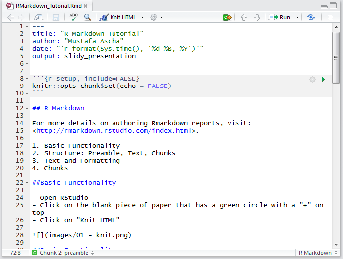
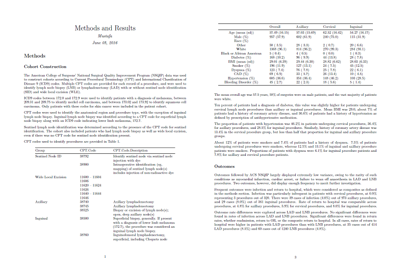
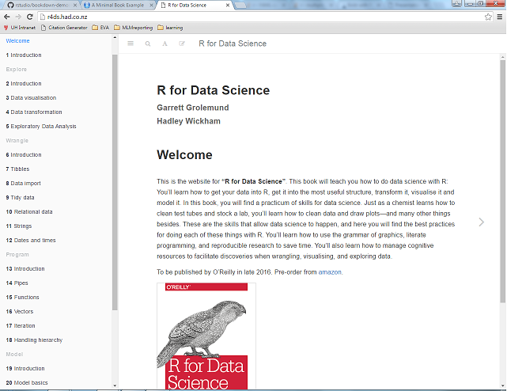
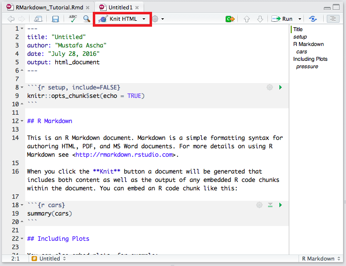
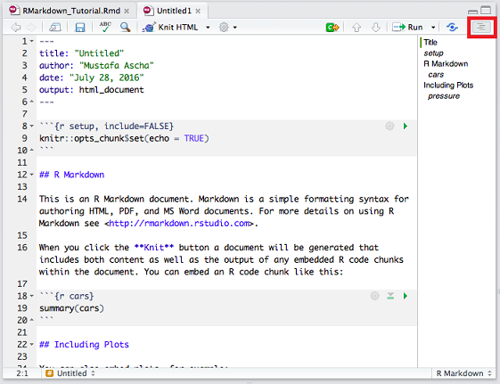
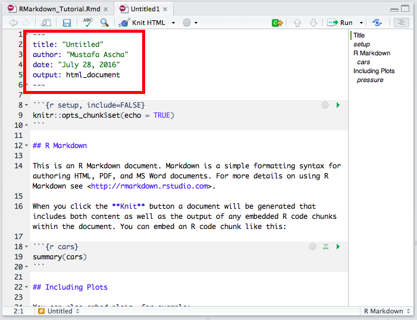
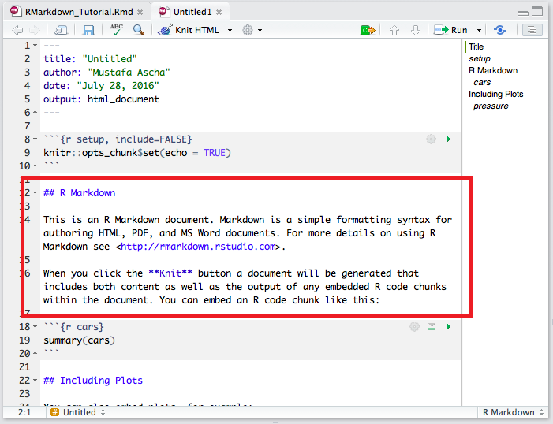
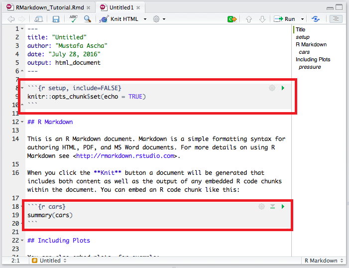

```{r setup, include=FALSE}
knitr::opts_chunk$set(echo = FALSE)
```

## R Markdown

For more details on authoring Rmarkdown reports, visit:  
<http://rmarkdown.rstudio.com/index.html>.

1. Basic Functionality
2. Structure: Preamble, Text, Chunks
3. Text and Formatting
4. Chunks and Inline Code

##Why R Markdown? 



##Why R Markdown? 



##Why R Markdown?



##Basic Functionality

- Open RStudio
- Click on the blank piece of paper that has a green circle with a "+" on top
- Click on "Knit HTML"



##Basic Functionality

- Open RStudio
- Click on the blank piece of paper that has a green circle with a "+" on top
- Click on "Knit HTML"  
(bonus) See the structure of your document by clicking on the staggered lines button at the top right of your editor




## Structure of a Report

- Preamble: Metadata (like an mp3 has artist, year, song title)



## Structure of a Report

- Preamble: Metadata (like an mp3 has artist, year, song title)
- Text: Where you put your commentary and thoughts



## Structure of a Report

- Preamble: Metadata (like an mp3 has artist, year, song title)
- Text: Where you put your commentary and thoughts
- Chunks: Where you put code that you can explain using text



##The Preamble

- This is where you specify things **about** your document, such as author, general format, or font color. 
- For now, the defaults will suffice. But, if you're interested, find more options [here](http://rmarkdown.rstudio.com/pdf_document_format.html) or [here](http://rmarkdown.rstudio.com/authoring_pandoc_markdown.html#yaml-metadata-block)

Here's an example: 

```{r preamble, echo = TRUE, eval = FALSE}
---
title:  'This is the title: \n it contains a colon and new line'
subtitle: 'This is a really short subtitle'
author:
- Author One
- Author Two
date: "`r format(Sys.time(), '%d %B %Y')`"
tags: [nothing, nothingness]
abstract: |
  This is the abstract.

  It consists of two paragraphs.
output: 
    pdf_document:
        template: NULL
---
```

## Text and Formatting

**Show them the markdown help!

```{r cars, echo = TRUE}
summary(cars)
```

## Slide with Plot

- Run a chunk using ""

```{r pressure}
plot(pressure)
```

