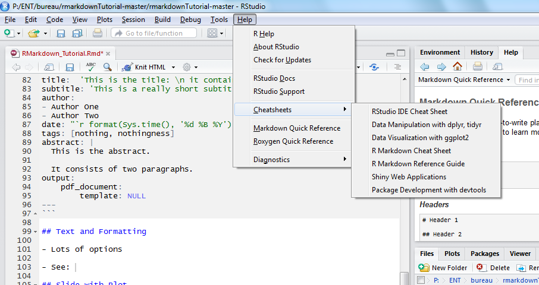
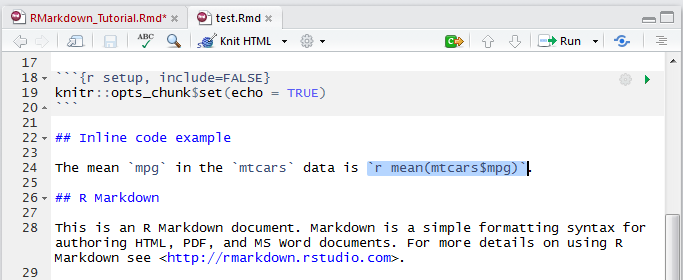
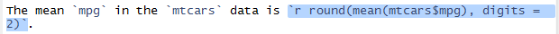
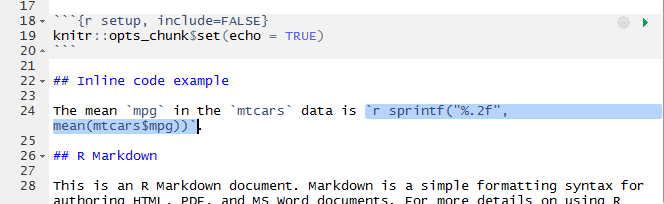
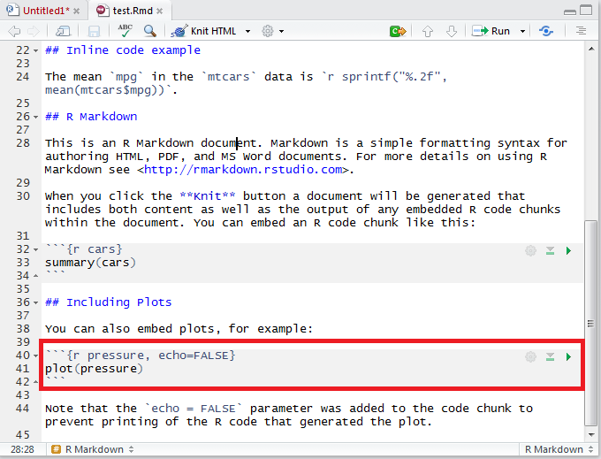
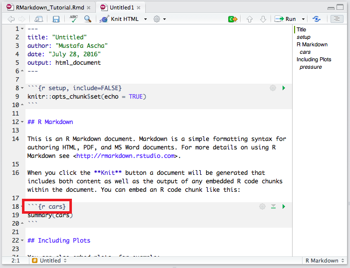
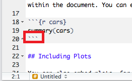
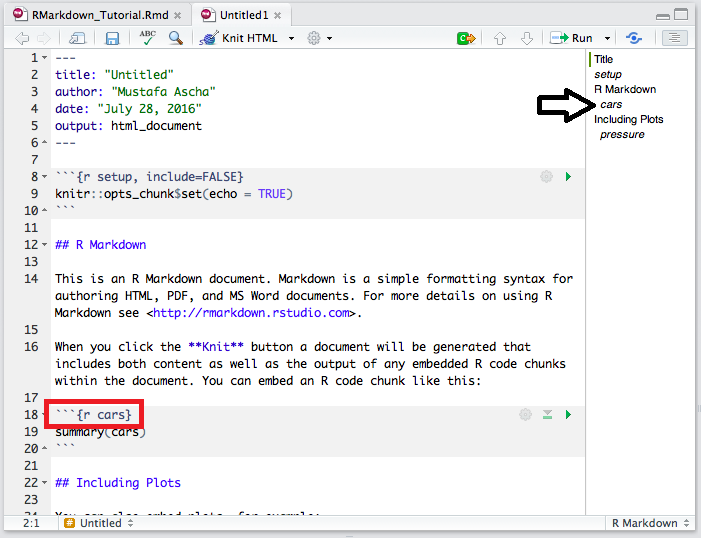
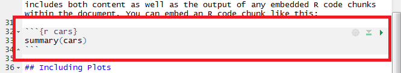
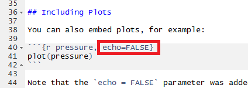

```{r setup, include=FALSE}
knitr::opts_chunk$set(echo = FALSE)
```

## R Markdown

For more details on authoring Rmarkdown reports, visit:  
<http://rmarkdown.rstudio.com/index.html>.

1. Motivation
2. Basic Functionality
3. Structure: Preamble, Text, Chunks
4. Text and Formatting
5. Chunks and Inline Code  

## Why R Markdown? 

You can make presentations like this one!


## Why R Markdown? 

You can automate your reports so they're easily reproducible!


## Why R Markdown?

You can write books (maybe a thesis or dissertation?) 


## Dynamic Documents

- Old way: Look at code output, write into document  
- New way: Write code, get document  

If you find out a patient has a value of 5 instead of 1, you won't have to go back and rewrite a report: you can just generate a new report! 

##Basic Functionality

- Open RStudio
- Make a new R Markdown document (select HTML for now)
- Click on "Knit HTML" (install packages first)


##Basic Functionality

- See the structure of your document by clicking on the staggered lines button at the top right of your editor


## Structure of a Report

- Preamble: Metadata (like an mp3 has artist, year, song title)


## Structure of a Report

- Preamble: Metadata (like an mp3 has artist, year, song title)
- Text: Where you put your commentary and thoughts


## Structure of a Report

- Preamble: Metadata (like an mp3 has artist, year, song title)
- Text: Where you put your commentary and thoughts
- Chunks: Where you put code that you can explain using text


##The Preamble

- This is where you specify things **about** your document, such as author, general format, or font color. 
- For now, mostly use the defaults. 
- Find more options [here](http://rmarkdown.rstudio.com/pdf_document_format.html) or [here](http://rmarkdown.rstudio.com/authoring_pandoc_markdown.html#yaml-metadata-block)

Here's an example: 

```{r preamble, echo = TRUE, eval = FALSE}
---
title:  'This is the title: \n it contains a colon and new line'
subtitle: 'This is a really short subtitle'
author:
- Author One
- Author Two
date: "`r format(Sys.time(), '%d %B %Y')`"
output: 
    html_document:
        template: NULL
---
```

## The Preamble: Table of contents

- Outline on the right of your text editor  
- Table of contents in the text. 

```{r preambleTOC, echo = TRUE, eval = FALSE}
---
title:  'This is the title: \n it contains a colon and new line'
subtitle: 'This is a really short subtitle'
author:
- Author One
- Author Two
date: "`r format(Sys.time(), '%d %B %Y')`"
output: 
    html_document:
        toc: true
        template: NULL
---
```

## Text and Formatting

- Lots of options  

## Text and Formatting

- Lots of options  
- See help! (There's lots of help)



## Text and Formatting: Text

- *Italicize* using a single star: 
   ``*italics*``  
- Make text **bold** by surrounding it with two asterisks: 
   ``**bold**``
- Add links by using brackets then parentheses: 
   ``[something something text](http://link.com)``


## Text and Formatting: Breaks

- If you want a new line, add two spaces to the end of your previous line
- Force RMarkdown to start a new page using ``\pagebreak``
- Horizontal ruler and pagebreak: use 3 or more dashes or asterisks:
  + ``----`` or ``****``

## Text and Formatting: Long quotes

- If you have a long quote, precede each line with ``>``

> Roses are red  
> Violets are blue  
> RMarkdown is cool  
> And so are you!  


## Text and Formatting: Headers

- Headers organize your document


## Text and Formatting: Headers

- Headers organize your document
- "Header 1" adds a new section to your document
 Add a header 1 using ``#``


## Text and Formatting: Headers

- Headers organize your document
- "Header 1" adds a new section to your document
 Add a header 1 using ``#``
- "Header 2" refers to a sub-header, kind of like a sub-section


## Text and Formatting: Headers

- Headers organize your document
- "Header 1" adds a new section to your document
   Add a header 1 using ``#``
- "Header 2" refers to a sub-header, kind of like a sub-section
   Add a header 2 using ``##``
- Add header 3 or 4 using ``###`` or ``####``

## Text and Formatting: Headers

- Headers organize your document
- "Header 1" adds a new section to your document
   Add a header 1 using ``#``
- "Header 2" refers to a sub-header, kind of like a sub-section
   Add a header 2 using ``##``
- Add header 3 or 4 using ``###`` or ``####``
- Your table of contents and document outline automatically update!
   Try it!!
  
  
## Text and Formatting: Inline code
  
- Add code output to your text by wrapping the code with backticks

This: 
  


## Text and Formatting: Inline code

- Add code output to your text by wrapping the code with backticks

This: 
  


Becomes this: 
  
The mean `mpg` in the `mtcars` data is `r mean(mtcars$mpg)`.

## Text and Formatting: Making inline code prettier

Lots of trailing digits is ugly, so `round` the output:
  


Becomes: 
  
The mean `mpg` in the `mtcars` data is `r round(mean(mtcars$mpg), digits = 2)`.


## Text and Formatting: Making inline code even prettier

- Sometimes you want even more control over the display of your numbers. 
- In this case, use `sprintf`



Becomes: 
  
The mean `mpg` in the `mtcars` data is `r sprintf("%.2f", mean(mtcars$mpg))`.


## Text and Formatting: Tables

- There are a few different ways, depending on formatting

## Text and Formatting: Tables, simple

This is a simple table, with one line per row:

```{r tableSimple, echo = TRUE, eval = FALSE}
  Right     Left     Center     Default
-------     ------ ----------   -------
     12     12        12            12
    123     123       123          123
      1     1          1             1

Table:  Demonstration of simple table syntax.
```

Notice where the cells' text is placed with respect to the hyphens above it. 

[Taken from the RStudio website.](http://rmarkdown.rstudio.com/authoring_pandoc_markdown.html#tables)

## Text and Formatting: Tables, simple

Becomes: 

  Right     Left     Center     Default
-------     ------ ----------   -------
     12     12        12            12
    123     123       123          123
      1     1          1             1

Table:  Demonstration of simple table syntax.

Notice that the text is justified in the same way that it is coded.

[Taken from the RStudio website.](http://rmarkdown.rstudio.com/authoring_pandoc_markdown.html#tables)

## Text and Formatting: Tables, multiline

- Sometimes you need more than one line in a row
- Use a multiline table:

```{r tableMultiline, echo = TRUE, eval = FALSE}

-------------------------------------------------------------
 Centered   Default           Right Left
  Header    Aligned         Aligned Aligned
----------- ------- --------------- -------------------------
   First    row                12.0 Example of a row that
                                    spans multiple lines.

  Second    row                 5.0 Here's another one. Note
                                    the blank line between
                                    rows.
-------------------------------------------------------------

Table: Here's the caption. It, too, may span
multiple lines.

```

Again, notice where the cells' text is placed with respect to the hyphens above it.

[Again, taken from the RStudio website.](http://rmarkdown.rstudio.com/authoring_pandoc_markdown.html#tables)

## Text and Formatting: Tables, multiline

- Sometimes you need more than one line in a row
- Use a multiline table:

-------------------------------------------------------------
 Centered   Default           Right Left
  Header    Aligned         Aligned Aligned
----------- ------- --------------- -------------------------
   First    row                12.0 Example of a row that
                                    spans multiple lines.

  Second    row                 5.0 Here's another one. Note
                                    the blank line between
                                    rows.
-------------------------------------------------------------

Table: Here's the caption. It, too, may span
multiple lines.

Again, the text is formatted the same way it is coded. 

[Again, taken from the RStudio website.](http://rmarkdown.rstudio.com/authoring_pandoc_markdown.html#tables)


## R Chunks

- R chunks are snippets of code that you can add to your report
- Automated report generation - rather than rewrite everything, click "knit"

Here's what a chunk looks like: 



## R Chunks: Structure

- Indicate the start of a chunk with three backticks and a chunk preamble



## R Chunks: Structure

- Indicate the end of a chunk with three backticks



## R Chunks: Structure

- They have names
- Names **must** be unique


## R Chunks: Structure

- Names are included in your outline



## R Chunks: Structure

- Names are included in your outline
- Name them well so you can stay organized
- Organization helps you find what you need in code, too!


## R Chunks: Behavior

When you compile your document, the chunk will show code output. 


## R Chunks: Behavior

When you compile your document, the chunk will show code output. 

This: 



## R Chunks: Behavior

Becomes: 

```{r exampleOutput}

summary(cars)

```

## R Chunks: Options

- You can set various options for your chunk
- Three options to know right now: `echo`, `message`, and `warning`



## R Chunks: Options

- `echo` decides whether to show the code AND output, or just the code

## R Chunks: Options

- `echo` decides whether to show the code AND output, or just the code
- `message` decides whether to show extra information that a function provides (besides its output), such as when `library` shows you that a package has a website (see: `ggplot2`)

## R Chunks: Options

- `echo` decides whether to show the code AND output, or just the code
- `message` decides whether to show extra information that a function provides (besides its output), such as when `library` shows you that a package has a website (see: `ggplot2`)
- `warning` decides whether to include...warnings. 

## R Chunks: Options

- Besides setting options for a specific chunk, you can also set chunk options for the entire document:

```{r optionsDoc, echo = TRUE, eval = FALSE}

knitr::opts_chunk$set(echo = FALSE, message = FALSE, warning = FALSE)

```

The previous options would show *only* code output. 


## R Chunks: Make things pretty with pander

- Install the `pander` library with `install.packages`

```{r panderLoad, echo = TRUE}

#install.packages("pander")

library(pander)

```


## R Chunks: Make things pretty with pander

- `pander` is a function (and a library) that makes your code output pretty. 
- You can give `pander` lots of diffent types of objects, such as dataframes or models

This: 

```{r exampleDFOutput, echo = TRUE}

mtcarsHead <- head(mtcars, n = 4)

mtcarsHead

```

## R Chunks: Make things pretty with pander

- `pander` is a function (and a library) that makes your code output pretty. 
- You can give `pander` lots of diffent types of objects, such as dataframes or models

Becomes: 

```{r examplePanderDF, echo = TRUE}

pander(mtcarsHead)

```

## R Chunks: Make things pretty with pander

- You can even give pander output from other functions!


```{r exampleChunkUgly, echo = TRUE}

pander(summary(cars))

```

## Future directions

- Citations
- Animated reports
- Interactive reports
- Presentations
- Books

## Conclusions

- R Markdown makes research easier  
- Lots of people have done lots of thinking about R Markdown, so you can find more information about it online

## Conclusions

- Thanks for not sleeping! 


